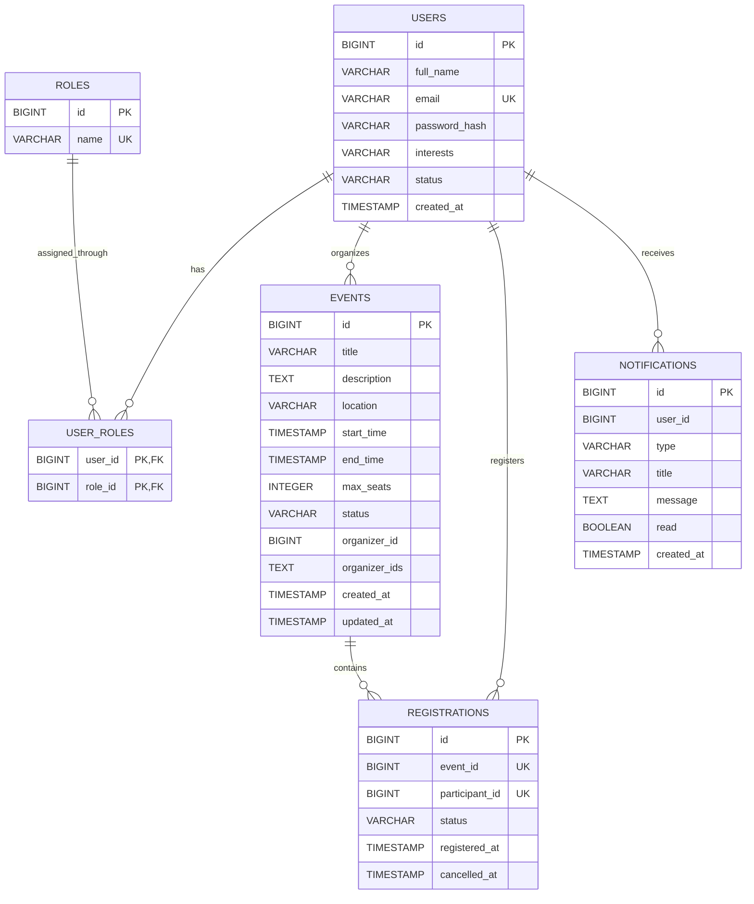

# Event Registration System ERD

This ERD is based on the implemented entities and Flyway migrations in the project.

Important note:
- The project uses a microservices architecture, so not all relationships are enforced as database foreign keys across services.
- `users`, `roles`, and `user_roles` live in the `auth-service` database.
- `events` lives in the `event-service` database.
- `registrations` lives in the `registration-service` database.
- `notifications` lives in the `notification-service` database.
- Relationships from `events`, `registrations`, and `notifications` back to `users` are logical service-level relationships.

## Mermaid ERD

## Entity Notes

### `users`
- Stores all system accounts.
- Public self-registration is limited to `PARTICIPANT`.
- Admins can create managed `ORGANIZER` and `PARTICIPANT` accounts.

### `roles`
- Stores role values:
  - `ADMIN`
  - `ORGANIZER`
  - `PARTICIPANT`

### `user_roles`
- Join table for the many-to-many relationship between users and roles.
- Uses a composite primary key: `(user_id, role_id)`.

### `events`
- Stores all event records.
- `organizer_id` is the primary organizer reference used in the schema.
- `organizer_ids` is a logical multi-organizer field stored as comma-separated text in the implementation.
- Event status is one of:
  - `SCHEDULED`
  - `RESCHEDULED`
  - `CANCELLED`

### `registrations`
- Stores attendee participation in events.
- Logical relationship to `events.id` and `users.id`.
- Business logic prevents duplicate active registrations.
- The initial schema uses a unique constraint on `(event_id, participant_id)`.
- Registration status is one of:
  - `REGISTERED`
  - `CANCELLED`

### `notifications`
- Stores in-system notifications for a specific user.
- Logical relationship to `users.id`.
- Read state is tracked by the `read` flag.

## Logical Relationship Summary

1. One `USER` can have many `ROLES`, and one `ROLE` can belong to many `USERS`.
2. One `USER` acting as an organizer can organize many `EVENTS`.
3. One `EVENT` can have many `REGISTRATIONS`.
4. One `USER` acting as a participant can create many `REGISTRATIONS`.
5. One `USER` can receive many `NOTIFICATIONS`.

## Suggested SRS Caption

Use this caption in your report if you want:

`Figure: Entity Relationship Diagram (ERD) for the Event Registration System, showing the core persisted entities and the logical cross-service relationships between authentication, event, registration, and notification data.`
