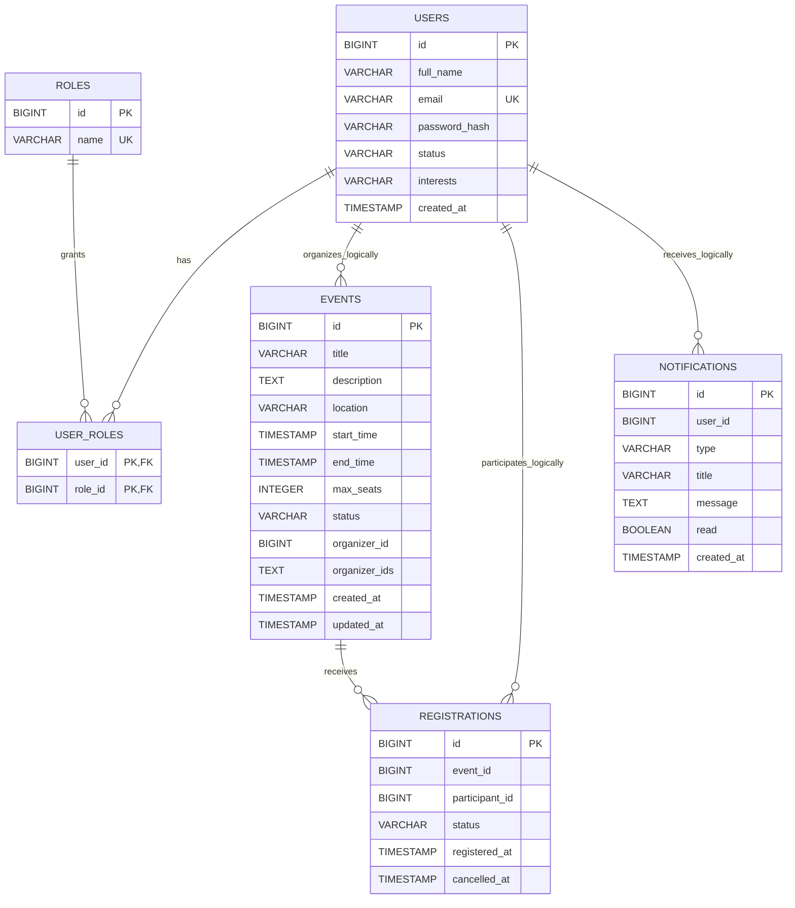

# Event Registration System ERD

This ERD models the latest database structure from service migrations.  
Because this project uses microservices with separate databases, relationships across services are **logical** (application-level) and not enforced with cross-database foreign keys.

## Mermaid Source

## Notes

- `USER_ROLES` enforces many-to-many between `users` and `roles` (auth-service DB).
- `registrations` enforces one active registration per `(event_id, participant_id)` using partial unique index where `status = 'REGISTERED'`.
- `events.organizer_ids` stores multi-organizer assignments as denormalized text (event-service DB).
- `event_id`, `participant_id`, and `user_id` in non-auth services are logical references to `auth-service`/`event-service` entities.
